# テーマ：生成AIアプリを作ってみよう
## 概要
- Dockerを使って最も簡単なサンプルアプリをコンテナ化
- サンプルアプリをAWSにデプロイする
  - ECR
  - AWS App Runner
- サンプルアプリを修正する
  - GPT-4o
- 修正したサンプルアプリをAWSにデプロイする
- デプロイしたAWS環境を削除する
## 事前準備の確認(10分)
- AWSアカウントの作成とクレジットカードの登録 [公式サイト](https://aws.amazon.com/jp/register-flow/)
- OpenAI APIキーの取得 [公式サイト](https://openai.com/index/openai-api/)
- Dockerのインストール [公式サイト](https://www.docker.com/ja-jp/products/docker-desktop/)
## lesson1
### Dockerを使って最も簡単なサンプルアプリをコンテナ化(10分)
- カレントディレクトリを「lesson1」に変更
- サンプルアプリ
  - [ソースコード](lesson1/app/main.py)

- Docker
```sh
docker build -t lesson .
docker run -p 8080:8080 lesson
```
`http://0.0.0.0:8080` にアクセスして `Hello, World!` と出力されたら成功

## サンプルアプリをAWSにデプロイする(10分)
1. AWSのコンソールを開き「Amazon Elastic Container Service」にアクセスします。
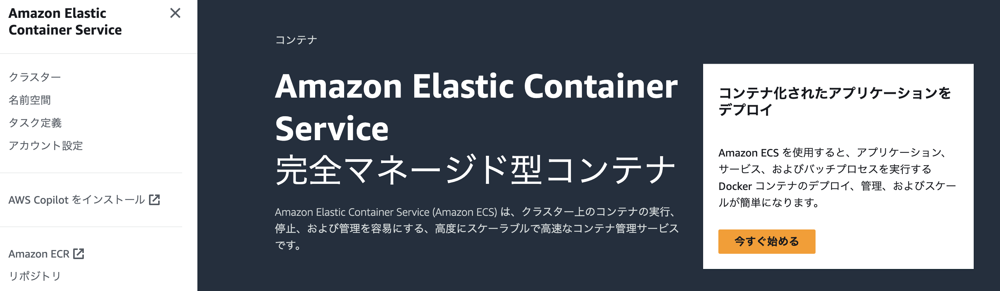

2. 左メニューから「Amazon ECR」をクリック
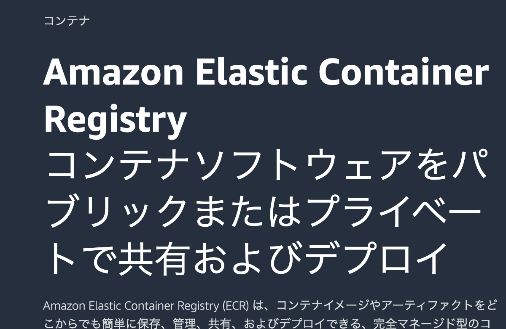

3. 左メニューから「Private registry > Repositories」をクリック
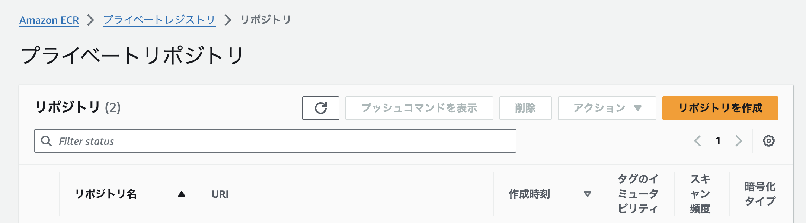

4. 「リポジトリを作成」をクリック

5. リポジトリ名に「lesson」と入力して「リポジトリを作成」をクリック
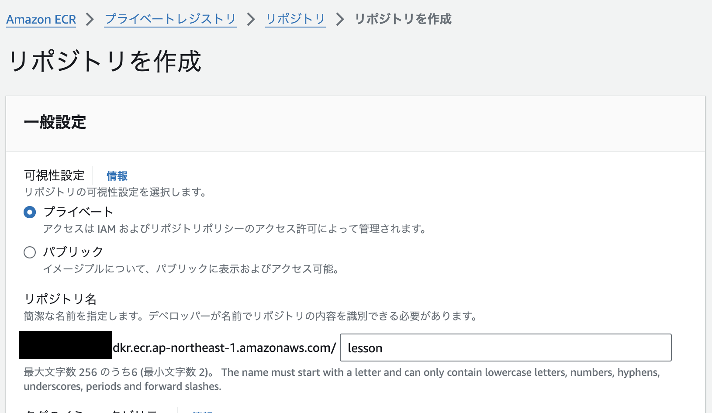

6. 作成したリポジトリ（ECR）のlessonを開いてDocker imageをプッシュする
- 右上の「プッシュコマンドを表示」をクリック
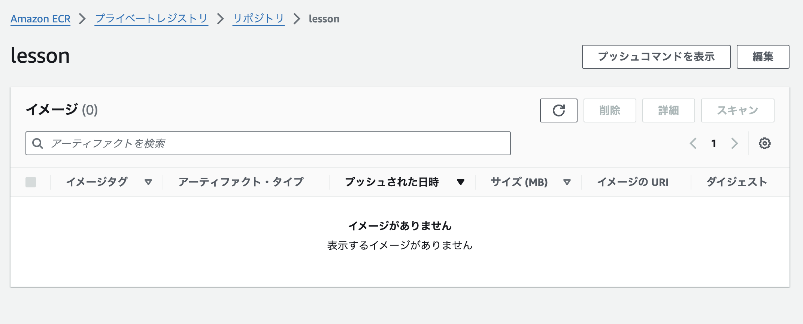
- カレントディレクトリを「lesson1」に移動してからプッシュコマンドを実行する

Docker イメージを構築する際に、`--platform linux/x86_64` を指定してください。

このようになります。
```sh
docker build -t lesson --platform linux/x86_64 .
```

7. Docker imageが表示されてたら成功
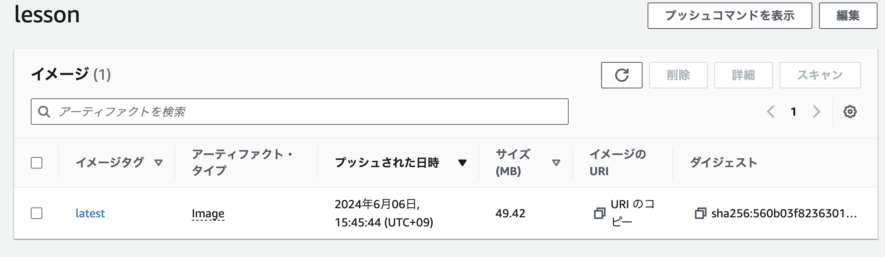

8. AWSのコンソールから「AWS App Runner」を開く
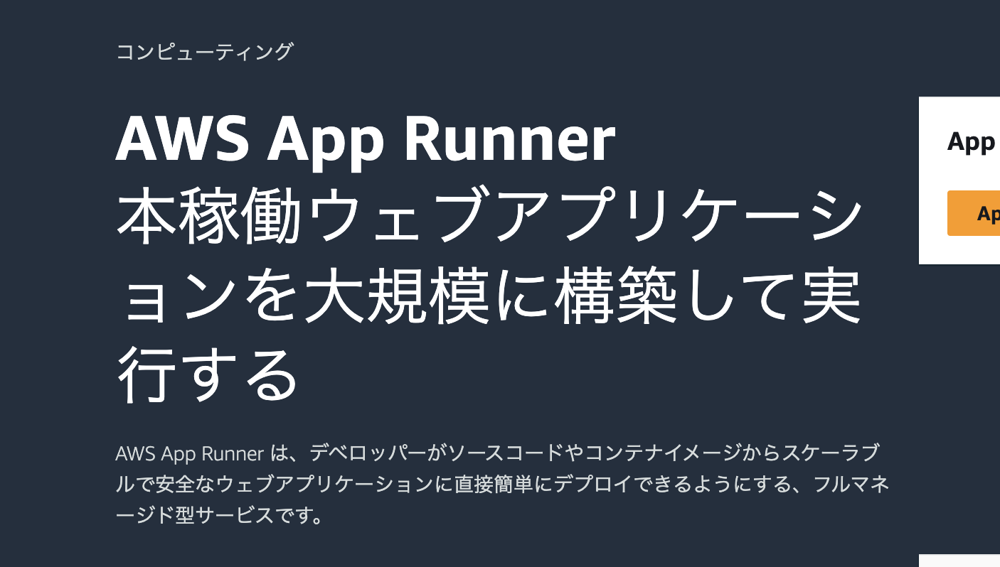

9. 「サービスを作成」をクリック
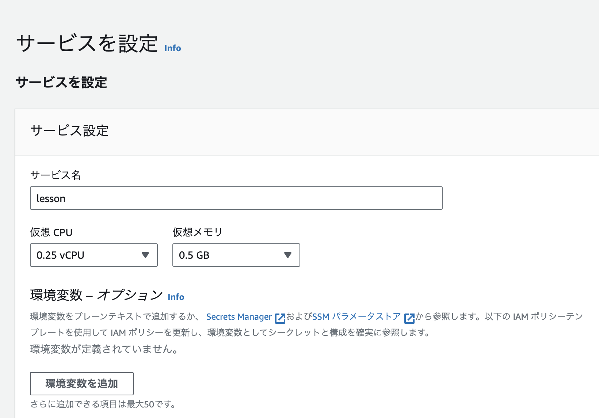

10. 入力して次へ
- コンテナイメージの URI
参照をクリックして、イメージリポジトリに「lesson」を入力
- デプロイトリガーを「自動」に変更
- ECR アクセスロールを「新しいサービスロールの作成」に変更

11. 入力して次へ
- サービス名に「lesson」を入力
- CPUとメモリは最小構成
- ポートは8080


12. 確認画面が表示されるので「作成とデプロイ」をクリック
デプロイが完了するまで数分かかります。

13. デプロイが成功した画面
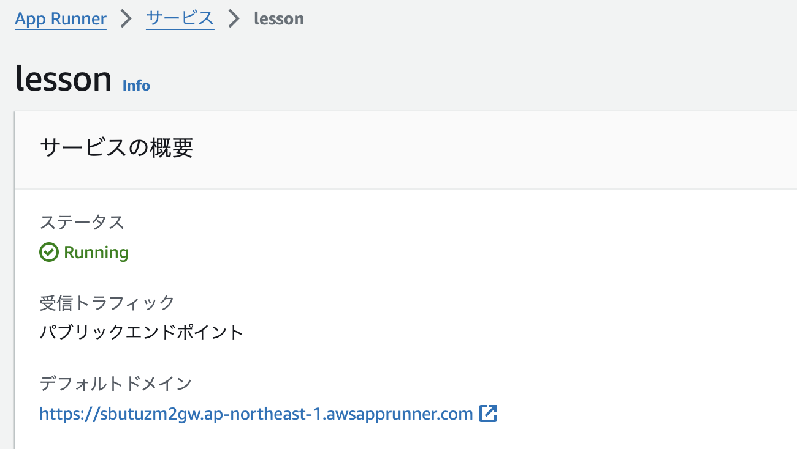

デフォルトドメインにアクセスして `Hello, World!` と出力されたら成功

## lesson2
### サンプルアプリを修正する(10分)
- カレントディレクトリを「lesson2」に変更
- サンプルアプリ
  - lesson1からの修正箇所を確認する
  - [修正したソースコード](lesson2/app/main.py)
  - [ライブラリ](lesson2/requirements.txt)


```sh
uvicorn app.main:app --host 0.0.0.0 --reload --port 8080

```
上記コマンドを実行すると、ローカルで確認出来ます。

ローカルホスト上 `http://0.0.0.0:8080/docs` でSwagger、 `http://0.0.0.0:8080/redoc` でAPI仕様書が確認できます。


### 修正したサンプルアプリをAWSにデプロイする(10分)
- 2回目以降はDocker imageをプッシュするだけでApp Runnerのデプロイが起動する。

## デプロイしたAWS環境を削除する(10分)
1. AWS App Runnerのサービスを削除するには右上の「アクション」メニューから「削除」をクリック
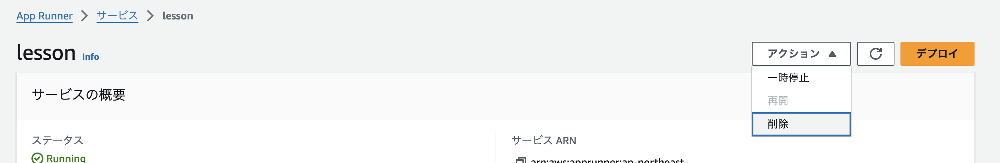

2. ECRのリポジトリを削除するにはリポジトリのメニューから「削除」をクリック
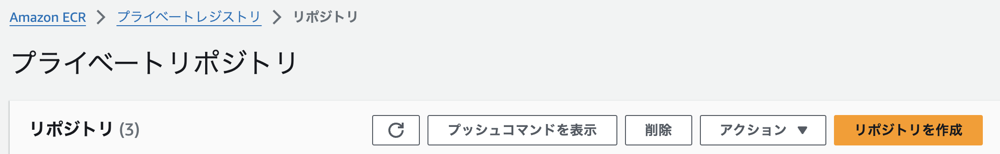

